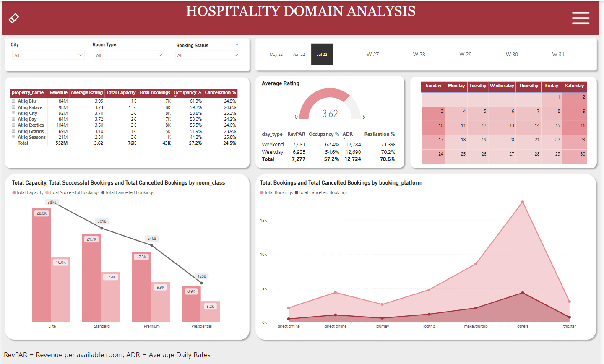

# Hospitality_Domain_Data_Analysis_Project

## Problem Statement

A Indian based hospitality company that owns multiple five-star hotels across India, intends to regain market share and revenue. As a strategic move, the revenue management team wants to incorporate  "Business and Data Intelligence" to derive meaningful comprehensive insights from their historical data.

## Objective 
Based on the mock dashboard provided by the stakeholders develop an interactive dashboard conveying crucial insights, key metrics & trend movements, enabling to make strategic data-driven decisions.

## Solution Approach

1. Data Cleaning and ETL(Extract, Transform and Load) in power query.
2. Data modelling (star schema).
3. Created metrics and utilised them in creating appropriate visualisations.

## Learning Outcomes

1. Importing from database to Power BI
2. Data cleaning and preparation for creating visualisations
3. Learned about some major practical DAX functions and measures.

## Final Dashboard
Check out the [dashboard](https://project.novypro.com/csK5I9).

