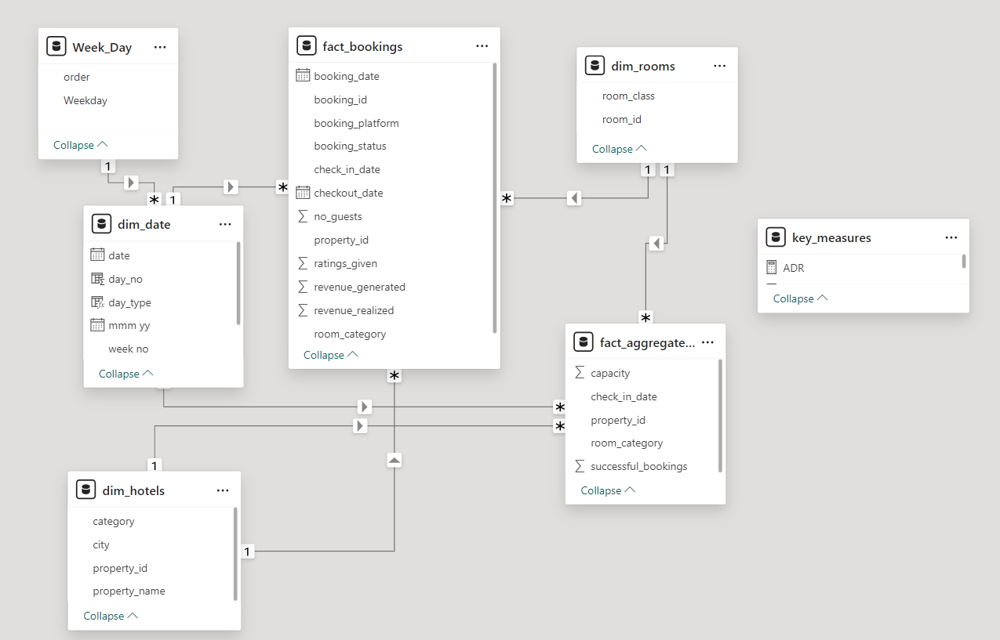

# Hospitality_Domain_Data_Analysis_Project

## Problem Statement

A Indian based hospitality company that owns multiple five-star hotels across India, intends to regain market share and revenue. As a strategic move, the revenue management team wants to incorporate  "Business and Data Intelligence" to derive meaningful comprehensive insights from their historical data with the intention to regain their market share and revenue

## Objective 
To develop an interactive and functional dashboard, by utilising the provided mockup as baseline, conveying crucial insights, key metrics and trend movements, enabling the stakeholders to make strategic data-driven decisions.

## Solution Approach

Workflow followed: Collecting data from source -> Power Query for Data Transformation -> creating measures using DAX -> Data Modelling -> Power BI Dashboard

#### Data Collection

The input dataset is provided in the form of collection of csv files. The files are stored in Power BI desktop using the import method.

#### Power Query 

The inut data tables are then loaded into power query to perform data transformation in order for the data to be utilised in the various visualizations. After briefly galncing over the tables the following modifications are done to the dataset:
- Selecting correct rows to be column headers in case it is not auotmatically detected
- Deleting column - In the business context of this project, Friday and Saturday are considered as weekend which isn't reflected in the data and hence the day_type column in dim_date table is deleted and recreated as per the requirement
- Checking for missing/null values if any

#### Data Analysis Expressions (DAX)

By utilizing various DAX functions and expressions calculated columns and several calculated measures are created that will be incorporated in the dashboard. The same can be found in the metrics list excel file.

#### Data Modelling 

The respective fact table and dimension tables are identified and relationships between them are establised in the star schema format. The reason for using star schema since most of the important data relating to business is present in one table which is the fact table.
The data model can be found in the image below:

#### Power BI Dashboard

A functional and interactive dahsboard is prepared in compliance with the mockup consisting of relevant visualizations, filters, slicers.

For week 32, denoted as W32, there is only row and hence incomplete. This may cause a distortion in dashboard and hence it is filtered from all the visuals by applying filter in the Filter pane.

Workflow followed: Data Source, collecting data -> Power Query transforming, cleaning -> DAX -> Data Modelling, choosing star schema since most of the important data lies in the fact table and optimal dashboard performance -> Dashboarding

## Learning Outcomes

- Different ways of loading data in Power BI. For this particular case the import method is a suitable option.
- Data cleaning and preparation for creating visualisations. It being an important step and how Power Query facilitates the same.
- Practical implementation of DAX and its significance in performing various computations and calculations
- Created page navigation feature through the usage of bookamrks and buttons
- Created a filter button that clears all the applied filters and resets the dashboard
- Learnt to build a new visual (Calendar visual) using matrix table, which can be utilized for different purpose of analyze. [(Article referred)](https://www.linkedin.com/pulse/calendar-matrix-syed-ahmed-ali/?trackingId=VgyLpo%2BYxVRs8tD03PXcPQ%3D%3D)

## Mockup Dashboard

## Key Takeaways

## Insights

- Mumbai generates the highest revenue (661 M) followed by Bangalore, Hyderabad and Delhi
- Atliq Exotica is the top performer among all the 7 owned properties with the stats being - 316 Million in revenue, having average rating of 3.62, 57% occupancy and 24% cancellation
- Week 24 recorded the highest revenue of around 140 Million
- Delhi ranks first in terms of both occupancy and overall rating followed by Hyderabad, Mumbai, Bangalore
- Elite type rooms are the most booked as well as higer cancellation in comaprison to other room types

## Recommendations

## Final Dashboard
Check out the [dashboard](https://project.novypro.com/csK5I9).
### Overall Analysis

### Monthly Analysis

### Tooltip Functionality for Key Metrics

