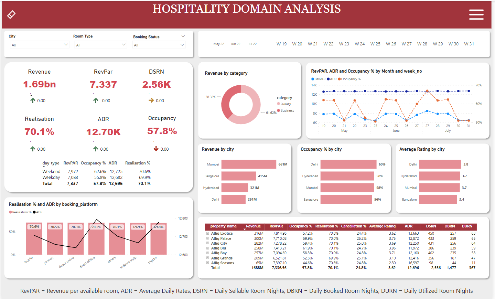
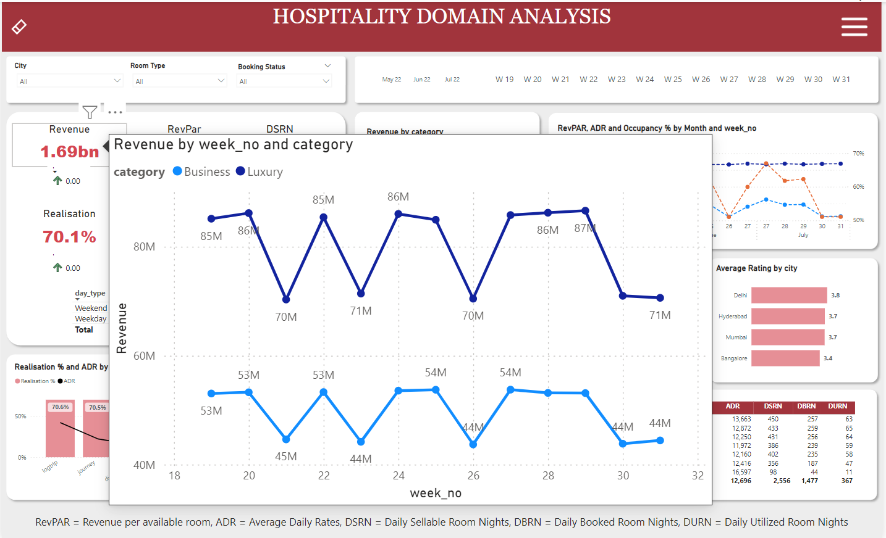

# Hospitality_Domain_Data_Analysis_Project

## Problem Statement

A Indian based hospitality company that owns multiple five-star hotels across India, intends to regain market share and revenue. As a strategic move, the revenue management team wants to incorporate  "Business and Data Intelligence" to derive meaningful comprehensive insights from their historical data with the intention to regain their market share and revenue

## Objective 
To develop an interactive and functional dashboard, by utilising the provided mockup as baseline, conveying crucial insights, key metrics and trend movements, enabling the stakeholders to make strategic data-driven decisions.

## Solution Approach

1. Data Cleaning, removing outlier W32 and ETL(Extract, Transform and Load) in power query
2. Data modelling (star schema). Identifying fact and dimension tables 
3. Created calculated measures using DAX expressions and utilised them in creating appropriate visualisations

Workflow followed: Data Source, collecting data -> Power Query transforming, cleaning -> DAX -> Data Modelling, choosing star schema since most of the important data lies in the fact table and optimal dashboard performance -> Dashboarding

## Learning Outcomes

1. Importing from database to Power BI
2. Data cleaning and preparation for creating visualisations
3. Learned about some major practical DAX functions and measures.
4. Created page navigation feature through the usage of bookamrks and buttons
5. Created a filter button that clears all the applied filters and resets the dashboard.
6. Learnt to build a new visual (Calendar visual) using matrix table, which can be utilized for different purpose of analyze. [(Articel referred)](https://www.linkedin.com/pulse/calendar-matrix-syed-ahmed-ali/?trackingId=VgyLpo%2BYxVRs8tD03PXcPQ%3D%3D)

## Insights/Conclusions/Recommendations

## Final Dashboard
Check out the [dashboard](https://project.novypro.com/csK5I9).
### Overall Analysis

### Monthly Analysis

### Tooltip Functionality for Key Metrics

